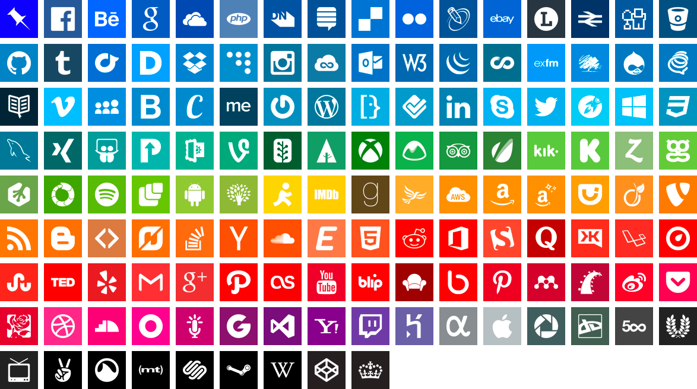

# Vector Icons

A free set of SVG icons in Scalable Vector Graphic files with an accompanying list of corporate colour codes. See the icons and colours at [our website](http://vectoricons.design).

## Feedback and Requests

I want to grow this set, so if you have a specific request—or a comment—create an <a href="https://github.com/danleech/simple-icons/issues">Issue</a> on this repository. Icons will be added over time, and existing ones may be updated. Alternatively you can tweet me [@superatic](https://twitter.com/super_atic).

### Webfont versions

This is definitely something I’d like to include, but it’ll require me to take some time off work to complete. Hopefully that will happen sometime this summer.  

P.S. If you have experience with best-practice optimisation and minification of SVG files please get in touch. I could do with honing my SVG workflow before embarking on a full refresh of this set.

## Moral Licence

The Vector Icons set and associated files are distributed by SuperAtic LABS under the [Moral Licence](http://artlibre.org/licence/lal/en). Company logos and icons may be subject to trademark and copyright conditions. Always check before deploying other companies’ branding on your own website.